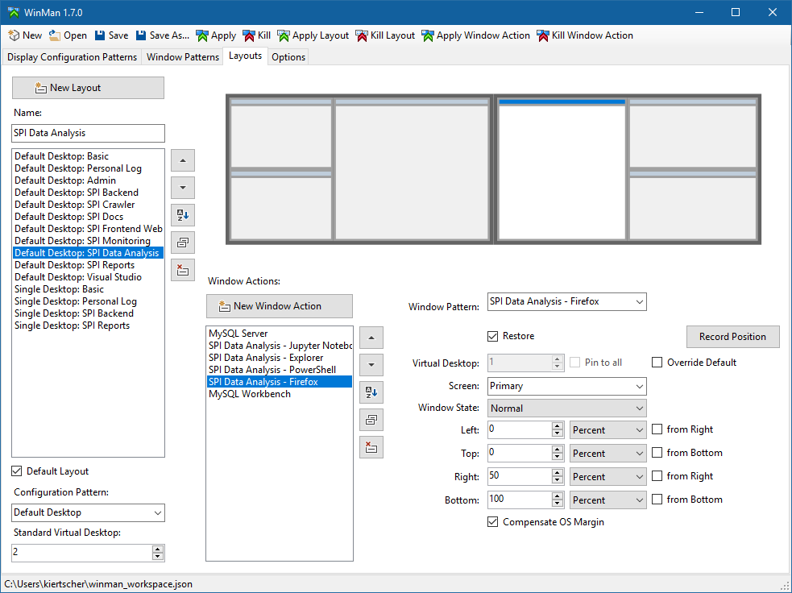
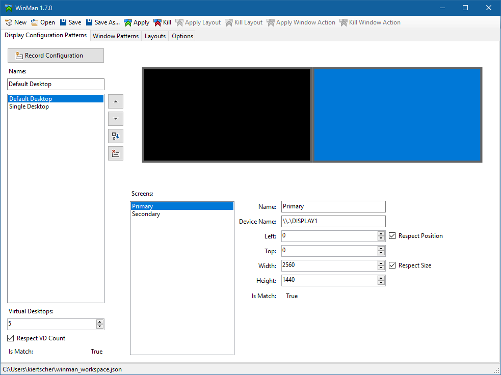
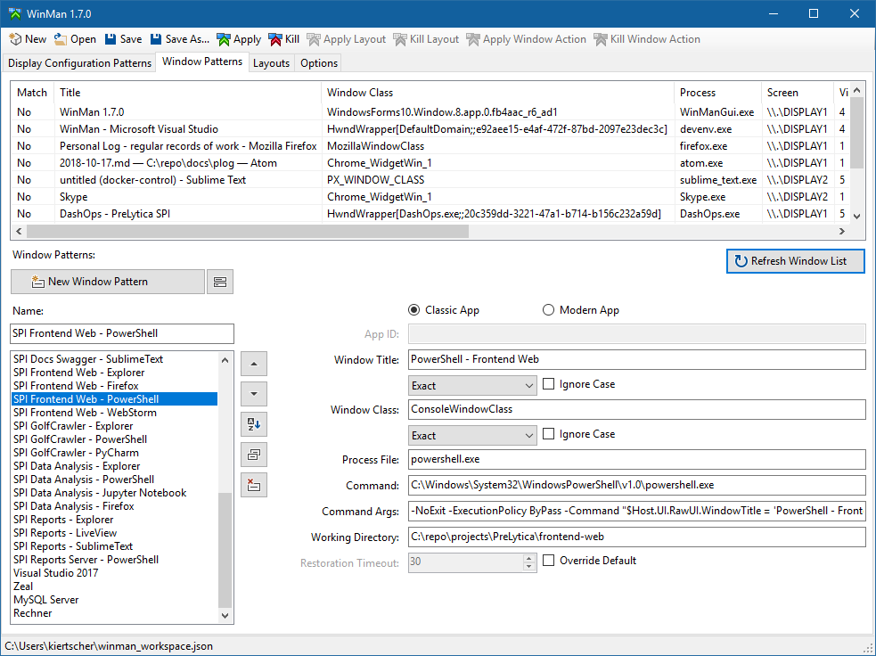

Mastersign WinMan
=================

> Manager for window layouts on Windows 10.

## Features

* Support for multiple display configurations / monitor setups
* Define multiple window layouts targeting only some or all of the display configurations
* Apply or kill window layouts via a graphical user interface or at the command line
* Support for modern apps

## Requirements

* Microsoft .NET Framework 4.6 or higher
* Since v1.5.0 _WinMan_ requires Windows 10 1803
* To use _WinMan_ on an earlier Windows 10 version
  download _WinMan_ v1.4.1

## Quick Introduction

1. Record one or more _Display Configurations Patterns_

    Imagine you use a notebook sometimes onyl with the integrated display, and sometimes in a docking station with two connected monitors.
    With display configuration patterns, you can prepare different window layouts targeting different monitor setups.

2. Record/create _Window Patterns_

    To detect whether a certain window is already opened or not, some properties like title, process name and window class are used.
	To restore a window as part of a window layout, additional information like a command string and command line arguments are configured.

3. Create _Layouts_

    A layout lists a number of window patterns and specifies where a matching window should be positioned and whether it should be restored or not, if no open window matches the pattern.
	Every layout is targeting a specific display configuration.
	The window position includes the screen, the virtual desktop, and the position in pixel or percent.

	Some layouts can be marked as default layouts. Default layouts are applied if no specific layout is selected.

4. Apply _Layouts_

	You can apply layouts via the GUI (graphical user interface) of _WinMan_ `WinManGui.exe`.
	But it is more practical, to create shortcuts which are calling the CLI (command line interface) of _WinMan_ `winman.exe`.

	E.g. `winman.exe --layouts "My Layout"`

	_WinMan_ is looking for a layout with the given name, which is targeting the current display configuration.
	If it finds one or more matching layouts it applies them.
	If a layout with the same name exists for every display configuration, it can allways be applied and the fitting layout for the current display configuration is selected.

5. Kill _Layouts_ (since version 1.7.0)

	To close all windows, which are part of a layout, the appropriate button in the GUI could be used.
	But as with applying, the CLI is a good way too.

	E.g. `winman.exe --layouts "My Layout" -K`

## Screenshots

## License

This project is published under the MIT license.
